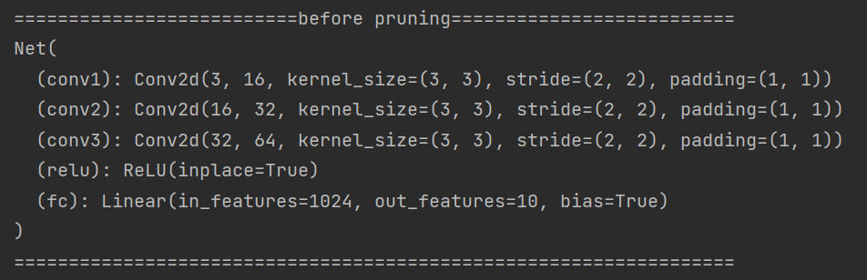
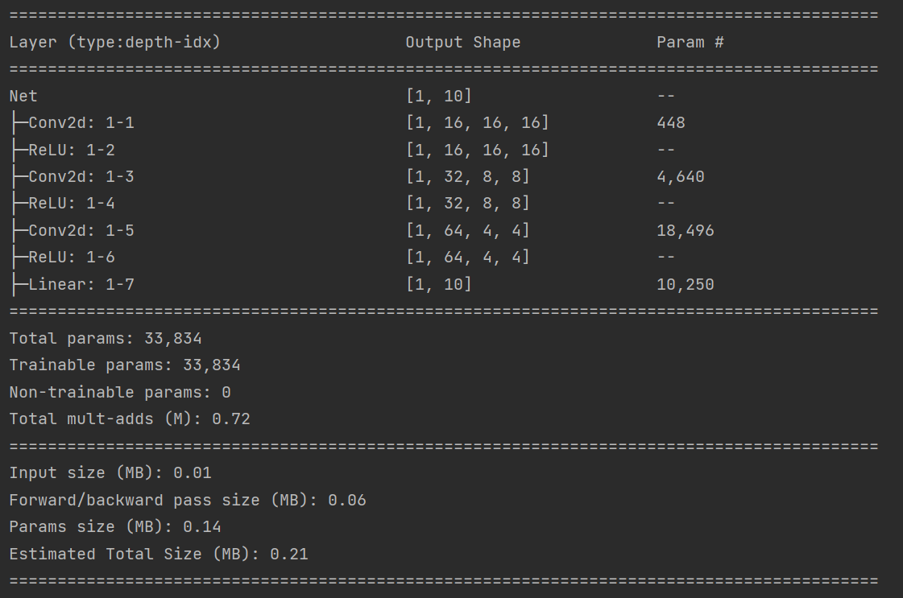
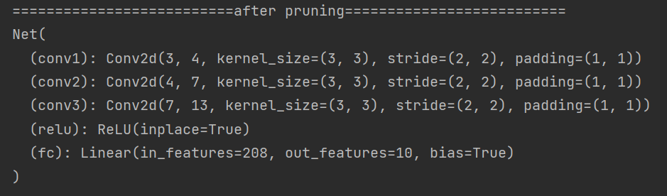
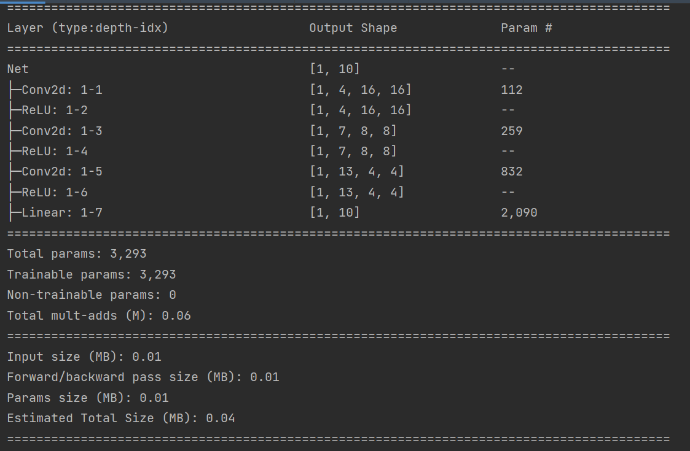
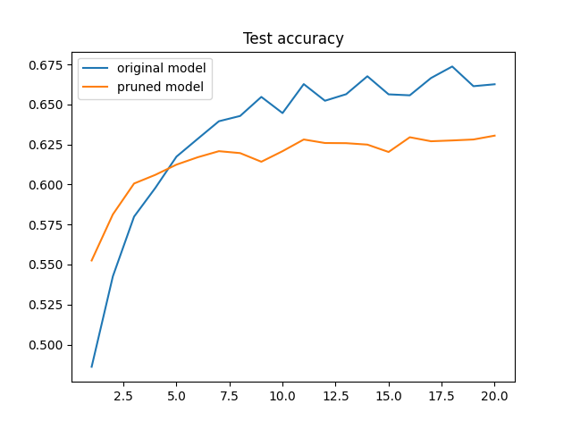

# Model Prune 
> 本项目使用微软的NNI进行模型剪枝

**原本模型的结构及参数：**

----------
**模型剪枝后的结构及参数：**

----------
**准确率对比:**（进行了修改，提高了epoch以及略微降低稀疏度）

**对比：**

参数量由原本的33834降低到3293。
参数占用内存由原本的0.14MB降低到0.01MB。
性能从最高63.9%降到最高53.84%，可能是由于网络结构过于简单所致，后续进行深入探究
